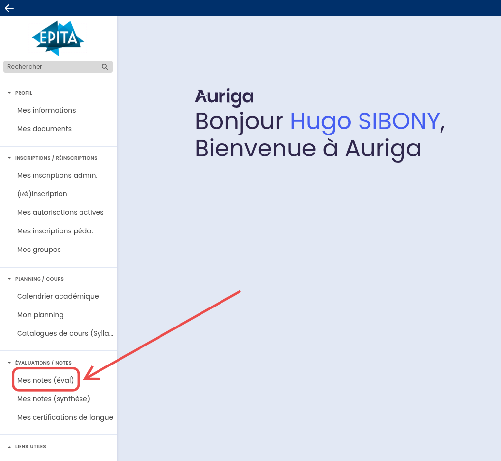
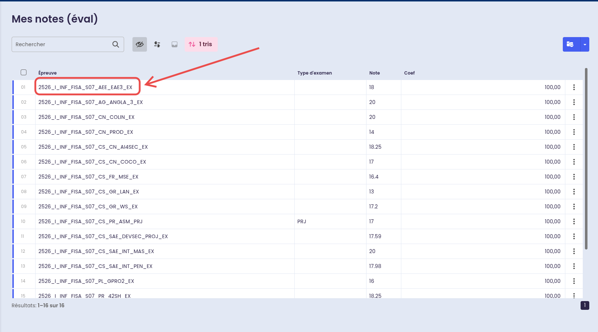

# Coefficients

Auriga treats all exams as equally weighted. This directory contains the **real** coefficients, contributed by the community.

## How to add coefficients for your semester

### 1. Find your exam codes

Open [auriga.epita.fr](https://auriga.epita.fr), go to your grades, then open DevTools (`F12`) and go to the **Network** tab:



Look for `POST` requests to `searchResult`. Click one, then look at the **Response** — each grade line contains the exam code:



> **Don't see the requests?** Make sure you have the Network tab open *before* navigating to your grades. If needed, refresh the page with DevTools open:
>
> 

### Exam code anatomy

```
2526_I_INF_FISA_S07_CS_GR_WS_EX
│    │ │   │    │   │  │  │  └─ eval type (EX, PRJ, EXF, ...)
│    │ │   │    │   │  │  └──── exam
│    │ │   │    │   │  └─────── subject
│    │ │   │    │   └────────── module
│    │ │   │    └────────────── semester
│    │ │   └─────────────────── track (FISA, FISE, GISTRE, ...)
│    │ └─────────────────────── school
│    └───────────────────────── always I
└────────────────────────────── academic year (25/26)
```

### 2. Create a file

Filename: `s{semester}_{year}_{track}.js` (all lowercase)

| Semester | Year | Track | Filename |
|----------|------|-------|----------|
| S07 | 2025/2026 | FISA | `s07_2526_fisa.js` |
| S08 | 2025/2026 | FISE | `s08_2526_fise.js` |
| S09 | 2026/2027 | GISTRE | `s09_2627_gistre.js` |

### 3. Fill in your coefficients

Copy this template:

```js
/**
 * Coefficients — S?? TRACK YEAR
 *
 * Only list exams whose coefficient is NOT 1.
 * Key = full exam code from Auriga API.
 * Value = real coefficient.
 */
export default {
    // Subject > Exam name (coeff X)
    'XXXX_I_INF_TRACK_SXX_MODULE_SUBJECT_EXAM_TYPE': 2,
};
```

See [`s07_2526_fisa.js`](s07_2526_fisa.js) for a real example.

### 4. Open a pull request

That's it. No other file to edit — coefficient files are auto-discovered at build time.
